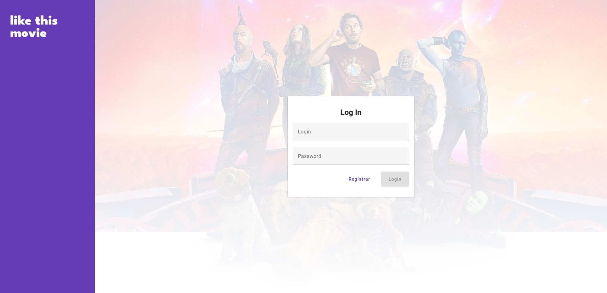
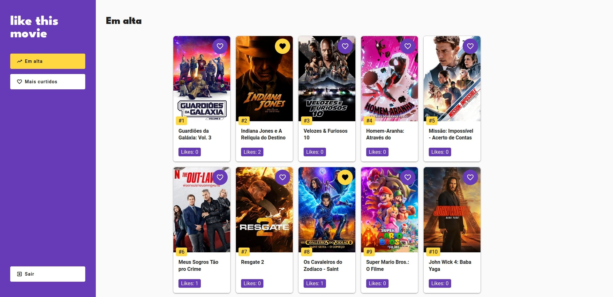

# 🎬 Like this movie

This project was created as a job test for Profectum + Unimed companies, showcasing my skills and expertise.

## 📝 Project Description

The project is an application that allows registered users to connect to the TMDB (The Movie Database) API to access trending movies. Users can like movies and view a separate page displaying the most liked movies within the app. The app provides a convenient way for users to discover popular movies and keep track of their preferences.

## ✨ Features

- ✅ **User registration**: Users can create accounts to access the app's features.
- 🎥 **TMDB API integration**: The app connects to the TMDB API to fetch trending movies.
- ❤️ **Like functionality**: Users can like movies to express their preferences.
- 🏆**Most liked movies page**: A separate page displays the movies with the highest number of likes within the app.
- 🔒 **JWT authentication**: The app incorporates JWT (JSON Web Token) authentication for secure user authentication and authorization. 

## 👩‍💻 Technologies Used

- 👽 [NestJS](https://nestjs.com/https://nestjs.com/): A progressive Node.js framework for building efficient and scalable server-side applications.
- 🔷 [Angular](https://angular.io/): A TypeScript-based open-source web application framework for building robust and dynamic frontend applications.
- 🐳 [Docker](https://www.docker.com/): A platform for automating the deployment and management of applications within software containers.
- 🍃 [MongoDB](https://www.mongodb.com/): A popular NoSQL database system used for storing and managing data.

## 🔧 Requirements

To run this project, you need to have the following prerequisites and dependencies installed:

- ⚙️ **Node.js 16.x**: You can download and install Node.js from the official website at [nodejs.org](nodejs.org). Node.js is a JavaScript runtime environment that is required to execute the project's server-side code.

- 🐳 **Docker**: Docker is a platform that allows you to automate the deployment and management of applications within containers. You can download and install Docker from [docker.com](docker.com).

- 🐳 **Docker Compose**: Docker Compose is a tool for defining and running multi-container Docker applications. It allows you to specify the services, networks, and volumes required by your application using a YAML file. Docker Compose is usually installed automatically when you install Docker.

- 🧶 **Yarn _(Optional)_**: Yarn is a package manager for JavaScript that provides a more efficient and reliable way of managing project dependencies compared to the default npm package manager. If you prefer using Yarn, you can install it by following the instructions at [yarnpkg.com](yarnpkg.com).

Ensure that the specified software versions are compatible with your operating system. Once you have installed these prerequisites, you will be ready to set up and run the project successfully.

## 💡 User Interface and User Experience

The project incorporates _some_ [Material Design](https://m3.material.io/) guidelines to create an intuitive and visually appealing interface for users. Material Design is a design language developed by Google that focuses on creating a consistent and unified user experience across different platforms and devices.

By following Material Design principles, the project aims to provide the following benefits:

- 🌈 **Visual Consistency**: The interface elements, colors, typography, and spacing adhere to the Material Design guidelines, resulting in a visually consistent and harmonious look and feel.

- ✨ **Intuitive Interactions**: Material Design emphasizes natural and intuitive interactions, such as meaningful animations, smooth transitions, and feedback to user actions. These interactions enhance usability and make the application more user-friendly.

- ♿ **Accessibility**: Accessibility is an important aspect of Material Design. The project strives to follow accessibility best practices to ensure that the interface is usable and accessible to a wide range of users, including those with disabilities.

By incorporating Material Design guidelines, the project aims to create an interface that not only looks visually appealing but also provides a delightful and engaging user experience.

### 🏠 _Login Page_*

\* _background change by the most trending movie_

### 🔥 _Trending Page_


## 🚀 Installation

Clone the repository.
```bash
git clone https://github.com/HenriqueArtur/Like-This-Movie
```

Install the dependencies for both the server and client applications.

```bash

cd packages/server
npm install
# or
yarn install

cd ../client
npm install
# or
yarn install
```

Set up the database.

```bash
docker-compose up -d
```

This command will start a MongoDB instance and mongo-express to manage the data. Adjust the configuration in the docker-compose.yml file if necessary.

Inside the `packages/server` directory, you will find a `.env.example` file. Copy this file and rename it to `.dev.env` if you intend to run the project in development mode.

Open the newly created `.dev.env` file and fill in the required fields with the appropriate values. These fields may include environment variables such as database connection settings, API keys, or any other configuration options specific to your project's needs.

If you plan to run the project in a production environment, create another file named simply `.env`. This file should also be located in the `packages/server` directory. Similarly, fill in the necessary configuration values specific to your production environment.

By following these steps, you can configure the project's settings based on your development or production environment.

## 🌐 API

The API code is located in the `packages/server` directory.

To start the API server, run the following command:

```bash
cd packages/server
npm run start
# or
yarn start
```

The API endpoint documentation was created using Swagger and can be accessed at https://localhost:3000/api when the project is started.

## 💻 Frontend

The frontend code is located in the `packages/client` directory.

To start the frontend application, run the following command:

```bash
cd packages/client
npm run start
# or
yarn start
```

Adjust any configuration settings in the `packages/client/src/environments` directory.

## 🧪 Testing

To ensure the reliability and correctness of the project, tests have been implemented using the Jest testing framework.

To run tests for the **server** application:

```bash
cd packages/server
npm run test
# or
yarn test
```

To run tests for the **client** application:

```bash
cd packages/client
npm run test
# or
yarn test
```